# Productify — Clean Architecture Flutter App

[](https://flutter.dev)
[](https://riverpod.dev)
[](https://docs.hivedb.dev/)
[](#architectural-philosophy)
[](#testing-pipeline)

> [!IMPORTANT]
> **Production Android Build Available**
> Download and install the compiled release APK to test all core and premium features directly on an Android device:
> [Download Productify v1.0.0 APK](https://github.com/Noctambulist007/Productify/releases/download/Productify/Productify_v1.0.0.apk)

A premium, state-of-the-art Flutter mobile application designed for the **BrandTECH Technical Task**. Productify showcases an interactive product catalog integrated with local persistence databases, premium micro-animations, theme flexibility, and robust clean-architecture standards.

---

## Visual Showcases

### Walkthrough Demonstration

An interactive, high-fidelity walkthrough demonstration of all user onboarding flows, search systems, filter queries, dark/light modes, related carousels, and local databases:
[View Productify Walkthrough Video](assets/github_readme/productify_full_app_walkthrough.mp4)

### Screen Captures

#### Splash and Onboarding

| Splash Screen | Onboarding 1 | Onboarding 2 |
| :---: | :---: | :---: |
| 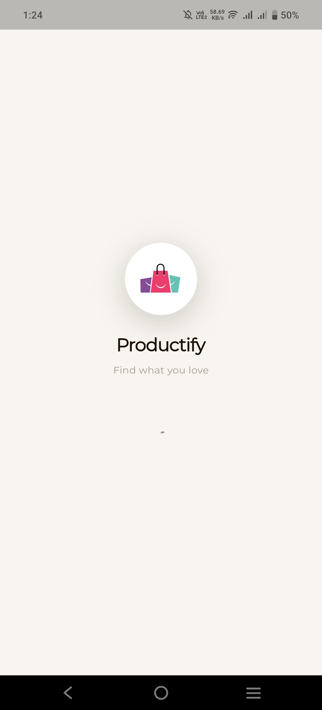 | 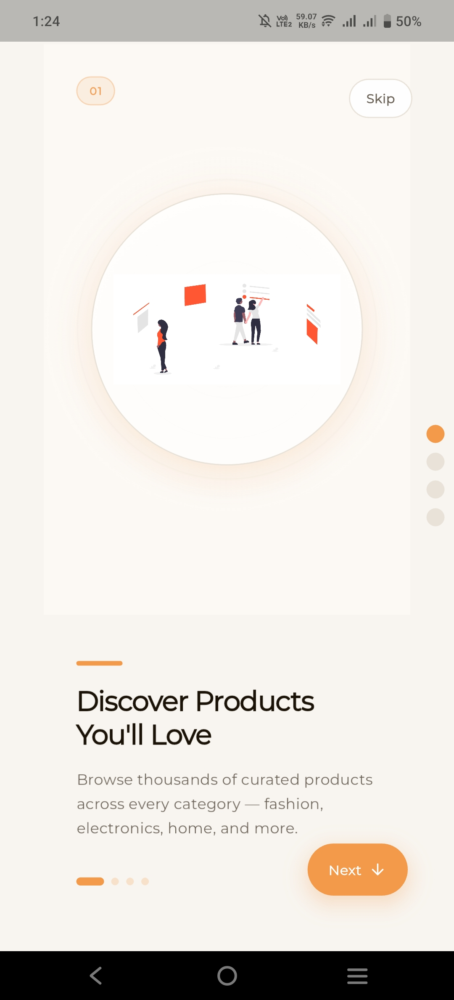 | 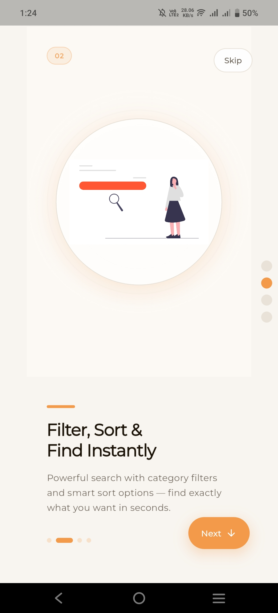 |

| Onboarding 3 | Onboarding 4 |
| :---: | :---: |
| 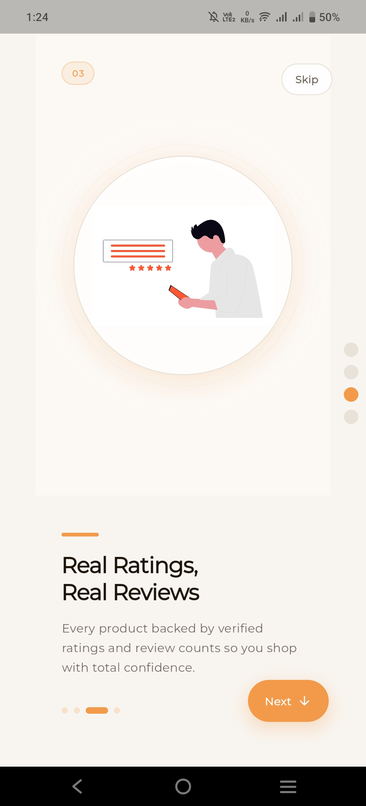 | 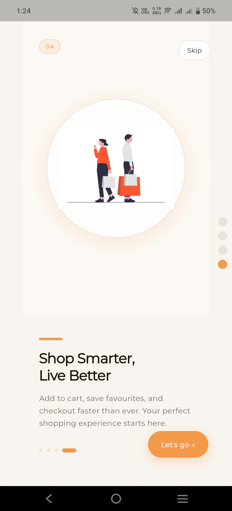 |

#### Home Feed and Advanced Search/Filter

| Home Feed (Light Mode) | Home Feed (Dark Mode) | Shimmer Loading State |
| :---: | :---: | :---: |
| 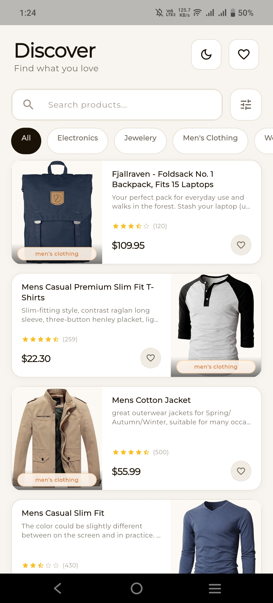 | 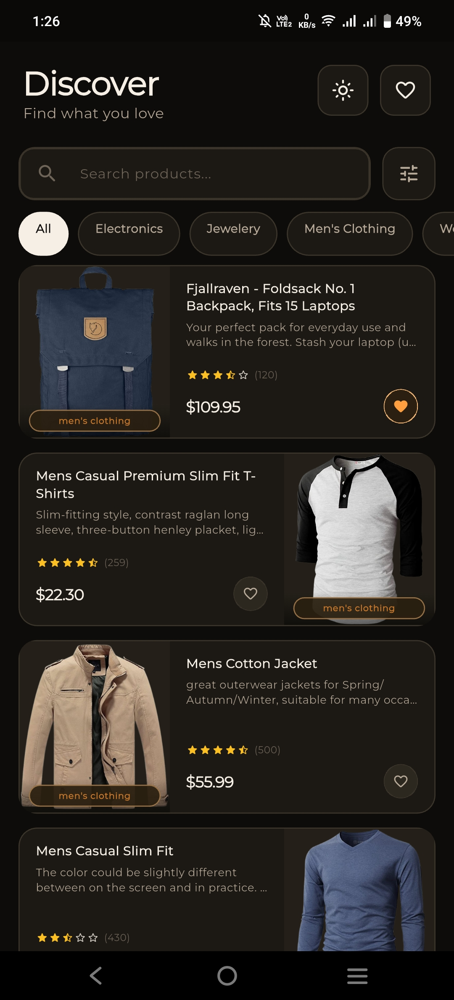 | 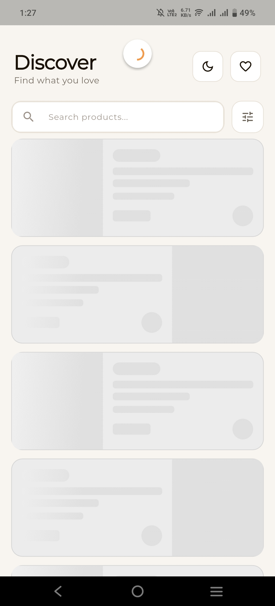 |

| Active Search Query | Advanced Sort and Filter Sheet |
| :---: | :---: |
| 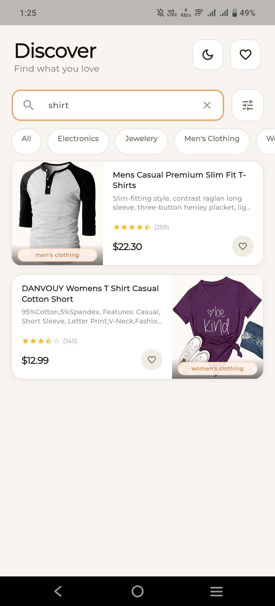 | 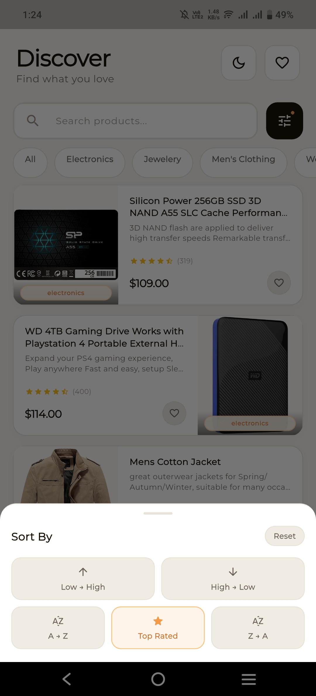 |

#### Product Specifications and Related Sections

| Product Details (Light Mode) | Specifications View | Product Details (Dark Mode) |
| :---: | :---: | :---: |
| 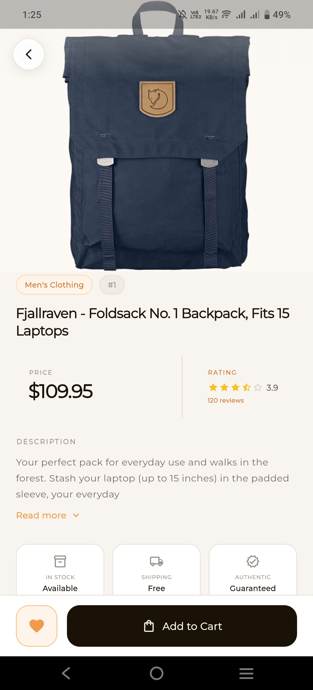 | 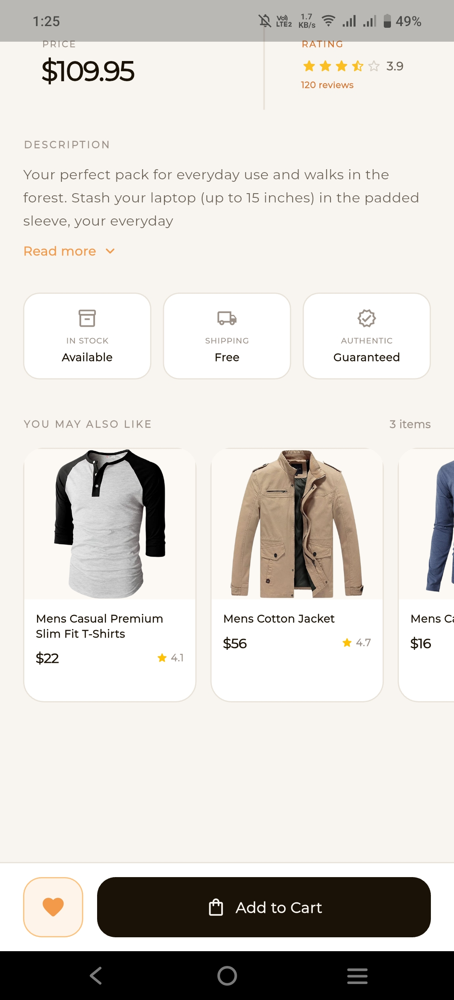 | 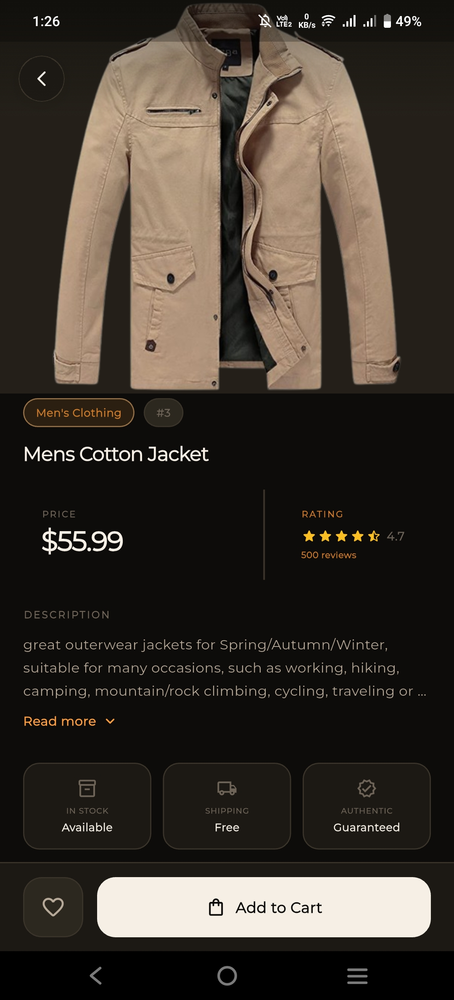 |

#### Favorites and Offline Persistence

| Favorites List (Light Mode) | Favorites List (Dark Mode) |
| :---: | :---: |
| 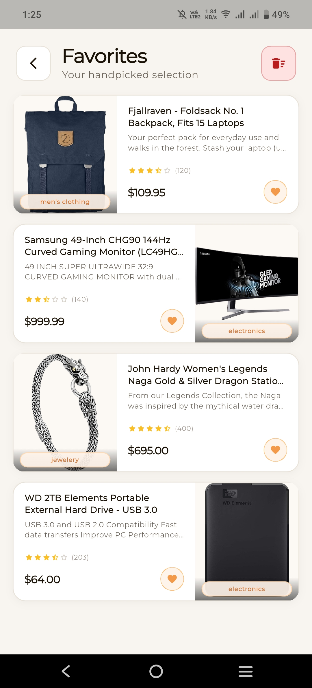 | 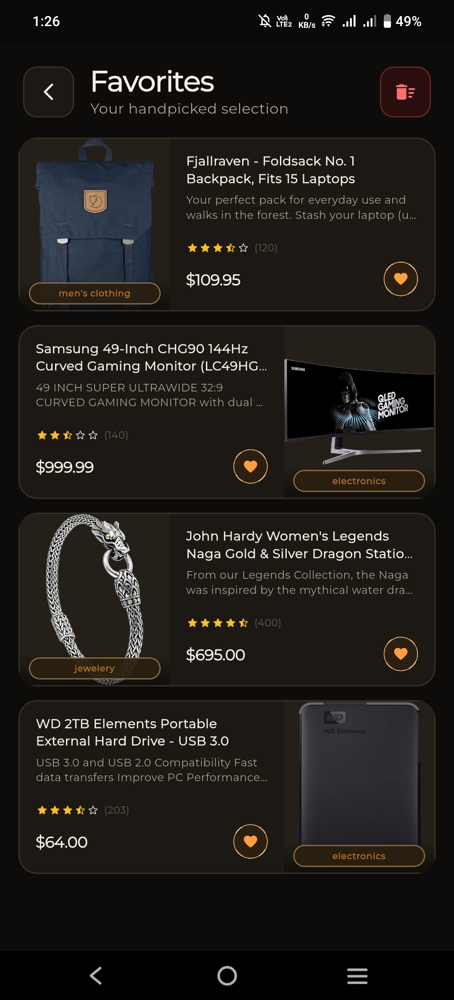 |

---

## Features Checklist & Beyond (Core vs. Premium)

This application satisfies all **BrandTECH Technical Task** requirements and goes above and beyond with premium additions:

### Technical Task Requirements (Core)
- [x] **Home Screen**: Fetches and displays products dynamically from `https://fakestoreapi.com/products`.
- [x] **Product Cards**: Exquisitely laid out cards showcasing `image`, `name`, `price`, and interactive rating chips.
- [x] **Search / Filtering**: Built-in real-time query filter on the product feed.
- [x] **State Feedback**: Adaptive shimmer loading indicators and intuitive offline/error widgets.
- [x] **Product Detail Screen**: Full product display (image, detailed descriptions, category info, price, and dynamic star rating).
- [x] **Favorites Feature**: Marked favorites persist locally (remains offline-safe).
- [x] **Favorites Screen**: Dedicated page to list, view, and instantly manage favorited items.
- [x] **UX Excellence**: Modern, responsive UI with fluid transitions.

---

### Premium Extras & Bonus Additions
*   **Immersive Splash Screen**: Clean visual transition on startup.
*   **Interactive 4-Screen Onboarding**: A stunning page slider using smooth typography, graphics, and indicator animations.
*   **Seamless Dark & Light Themes**: Dynamic app-wide dark mode support with tailored HSL primary assets.
*   **High-Performance Image Caching**: Network images are locally cached (`cached_network_image`) for zero internet lag.
*   **Full-Screen Zoomable Gallery**: Tap any product image to zoom, rotate, and interact in full resolution.
*   **Expandable Descriptions**: Long details are cleanly collapsed with a tap-to-expand option.
*   **Pull-to-Refresh Support**: Refresh feeds on the go.
*   **Incremental Pagination and Lazy Loading**: Optimised product feed pagination that maintains a fixed page 1 and dynamically scales page limits in steps of 10 up to the API ceiling of 20 items. This incorporates premium full-card shimmer load-more placeholders and reliable end-of-list visual cues when all items have successfully loaded.
*   **Related Products Carousel**: Suggests contextual matching products on details pages.
*   **5-Way Advanced Filter Engine**: Filter by search text, sort by categories, prices, ratings, and count fields.
*   **Robust Unit Test Suite**: Completely tested using custom Repository Fakes and Riverpod Container controllers.

---

## Architectural Philosophy

The project is structured under **Clean Architecture** to ensure clean separation of concerns, testability, and fast iteration:

```
lib/
├── data/                                 # Data Layer (Network Clients & DB storage)
│   ├── datasource/
│   │   ├── local/source/                 # Local Storage (Hive database favorites)
│   │   └── remote/                       # Remote Client (Dio endpoint clients)
│   ├── mapper/                           # Response Model ➔ Domain Entity Mappers
│   └── repository/                       # Implementation of Domain Repositories
│
├── domain/                               # Domain Layer (Strictly Dart, Zero Framework dependence)
│   ├── model/                            # Data Entities (Core Business Objects)
│   ├── repository/                       # Contract Interfaces
│   └── usecase/                          # Single-Responsibility Feature Operations
│
├── presentation/                         # Presentation Layer (UI & State Controllers)
│   ├── common/widget/                    # Reusable Global UI components
│   ├── dialog/                           # Custom Modals and overlays
│   ├── screen/                           # Application Pages (Home, Onboarding, Detail, Splash)
│   └── theme/                            # Color Themes, Styles & Extensions
│
├── di/                                   # Modular Dependency Injection (GetIt)
├── main.dart                             # Main Entry Point
└── productify.dart                       # Core Material App Initialization
```

---

## Core Libraries & Plugins Used

### Production Dependencies

| Dependency | Version | Purpose |
| :--- | :--- | :--- |
| **`flutter_riverpod`** | `^3.3.1` | Advanced reactive state management with dependency caching |
| **`hive`** | `^2.2.3` | Lightweight and fast key-value database written in pure Dart |
| **`hive_flutter`** | `^1.1.0` | Hive extension for Flutter, providing easy integration with Box listeners |
| **`dio`** | `^5.7.0` | Secure and feature-rich network HTTP client with interceptors |
| **`awesome_dio_interceptor`** | `^1.3.0` | Developer-friendly terminal HTTP request and response logging |
| **`cached_network_image`**| `^3.4.1` | Multi-tiered offline image caching and placeholder loading shimmers |
| **`get_it`** | `^9.2.1` | Dependency injection service locator for decoupled architectures |
| **`shimmer`** | `^3.0.0` | Premium loading effect indicators for grid and list shimmers |
| **`flutter_screenutil`** | `^5.9.3` | Professional layout adaptation for responsive screen scaling |
| **`flutter_carousel_intro`** | `^1.0.13` | Highly interactive onboarding introduction slide carousel |
| **`shared_preferences`** | `^2.3.5` | Key-value store for simple settings and local variables |
| **`freezed_annotation`** | `^3.1.0` | Declarative definitions for code-generated immutable classes |
| **`json_annotation`** | `^4.9.0` | Direct configuration rules for serializing class models |
| **`intl`** | `^0.20.2` | Advanced text internationalization and currency formatting helpers |
| **`timezone`** | `^0.11.0` | Multi-zone time translation and local scheduling helpers |
| **`zentoast`** | `^0.2.2` | Clean floating notification snackbars and visual feedback |
| **`cupertino_icons`** | `^1.0.8` | Standard iOS visual graphic icon assets |
| **`flutter_launcher_icons`** | `^0.14.4` | Built-in CLI tool to easily rebuild Android/iOS app launcher icons |
| **`icons_launcher`** | `^3.0.3` | Automated asset launcher icon builder helper |
| **`flutter_native_splash`** | `^2.3.1` | Native startup background splash screen generator |

### Development Dependencies

| Dependency | Version | Purpose |
| :--- | :--- | :--- |
| **`build_runner`** | `^2.4.13` | Command-line execution framework for code-generators |
| **`freezed`** | `^3.2.5` | Generation engine for type-safe product states and models |
| **`json_serializable`** | `^6.9.4` | Code generator that automatically handles DTO class deserialization |
| **`flutter_lints`** | `^6.0.0` | Recommended Dart style and pattern guidelines |
| **`flutter_test`** | `sdk: flutter` | Dedicated Flutter widget and unit testing engine |

---

## Testing Pipeline

The application features a comprehensive unit testing architecture located inside the `test/` directory.

### What is Tested?
1.  **Serialization & Domain Mapping**: Verifies correct JSON responses from network endpoints and their transformations.
2.  **Onboarding State Engine**: Validates carousel slide states and completion callbacks.
3.  **Favorites State Notifier**: Asserts list loading, adding items, toggling, removing, and database-safe bulk removals.

> [!NOTE]
> All unit tests are executed using **Type-Safe Mock Repositories (`FakeFavoriteRepository`, `FakeOnboardingRepository`)** and run completely isolated from any actual Hive databases or network adapters for rapid-fire VM execution.

### How to Run the Tests:
Ensure your environment is set up and execute the following commands in your workspace:

```bash
# 1. Clear caching
flutter clean

# 2. Get dependencies
flutter pub get

# 3. Run all tests
flutter test
```

---

## Setup & Execution Guide

Follow these quick commands to build and run the application locally:

### Prerequisites
*   Flutter SDK version `^3.11.1` or higher.
*   Cocoapods installed (for iOS builds).

### Step-by-Step Installation
1.  **Clone the repository**:
    ```bash
    git clone https://github.com/Noctambulist007/Productify.git
    cd productify
    ```

2.  **Install dependencies**:
    ```bash
    flutter pub get
    ```

3.  **Run Code Generators (Freezed & JSON Serializers)**:
    ```bash
    flutter pub run build_runner build --delete-conflicting-outputs
    ```

4.  **Run the application**:
    ```bash
    # Run on default connected emulator or device
    flutter run
    ```

---

## Submission Information
*   **Repository URL**: [https://github.com/Noctambulist007/Productify.git](https://github.com/Noctambulist007/Productify.git)
*   **Submission Date**: May 18, 2026 (Submitted well before the May 20 deadline!)

---

*Developed for the BrandTECH Mobile App Developer Task.*
