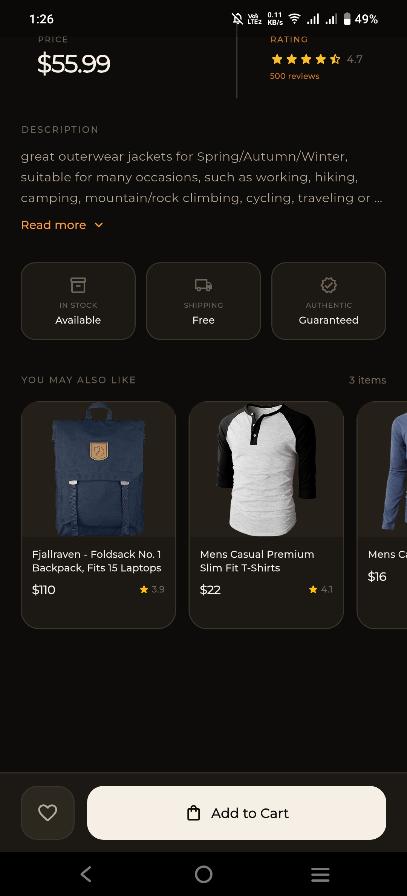

<div align="center">


# ✦ Productify

### *A premium Flutter product catalog — built for the BrandTECH Mobile App Developer Task*

<br/>

[](https://flutter.dev)
[](https://dart.dev)
[](https://riverpod.dev)
[](https://docs.hivedb.dev)
[](#architecture)
[](#testing)
[](https://github.com/Noctambulist007/Productify/releases/download/Productify/Productify_v1.0.0.apk)

<br/>

> **Productify** is a state-of-the-art Flutter application that goes far beyond a basic product listing app.
> It delivers a polished, production-grade experience with immersive onboarding, dark/light theming,
> advanced filtering, full-screen image zoom, incremental pagination, and a fully tested clean architecture.

<br/>

[**Download APK**](https://github.com/Noctambulist007/Productify/releases/download/Productify/Productify_v1.0.0.apk) &nbsp;·&nbsp;
[**Watch Demo**](#demo) &nbsp;·&nbsp;
[**Screenshots**](#screenshots) &nbsp;·&nbsp;
[**Quick Start**](#quick-start) &nbsp;·&nbsp;
[**Architecture**](#architecture)

</div>

---

<br/>

## Demo <a name="demo"></a>

<div align="center">

<!-- Video walkthrough — click the thumbnail below to watch the full demo -->

[](assets/github_readme/productify_full_app_walkthrough.mp4)

> **[▶ Watch Full App Walkthrough](assets/github_readme/productify_full_app_walkthrough.mp4)** — covers all screens, dark/light mode, filtering, favorites, and animations.

</div>

---

<br/>

## Screenshots <a name="screenshots"></a>

### Splash & Onboarding

<div align="center">

| Splash | Onboarding 1 | Onboarding 2 | Onboarding 3 | Onboarding 4 |
|:---:|:---:|:---:|:---:|:---:|
|  |  |  |  |  |

</div>

---

### Home Screen

<div align="center">

| Dark Mode | Light Mode | Shimmer Loading | Search |
|:---:|:---:|:---:|:---:|
|  |  |  |  |

</div>

---

### Product Detail

<div align="center">

**Dark Mode**

| Detail View 1 | Detail View 2 |
|:---:|:---:|
|  |  |

**Light Mode**

| Detail View 1 | Detail View 2 |
|:---:|:---:|
|  |  |

</div>

---

### Favorites & Filtering

<div align="center">

| Favorites (Dark) | Favorites (Light) | Sort & Filter Sheet |
|:---:|:---:|:---:|
|  |  |  |

</div>

---

<br/>

## Features <a name="features"></a>

### Core Task Requirements

| # | Feature 
|---|---------
| 1 | Fetch & display products from `fakestoreapi.com/products` 
| 2 | Product cards with image, name, price & rating 
| 3 | Real-time search / filter bar 
| 4 | Shimmer loading indicators 
| 5 | Error & offline state handling 
| 6 | Product detail screen (image, title, description, price, category, rating) 
| 7 | Mark / unmark favorites 
| 8 | Local favorites persistence with **Hive** 
| 9 | Dedicated Favorites screen
| 10 | Clean, responsive UI with smooth navigation 

### Bonus / Premium Extras

| Feature | Details |
|---------|---------|
| **State Management** | Riverpod v3 — reactive, scalable, fully provider-cached |
| **Dark / Light Mode** | System-aware dynamic theme with tailored HSL assets |
| **Animations** | Hero transitions, page slide animations, shimmer effects |
| **Immersive Splash** | Native splash screen with custom branding |
| **4-Screen Onboarding** | Animated carousel with typography, graphics & skip logic |
| **Image Caching** | `cached_network_image` — zero-lag offline image serving |
| **Full-Screen Zoom Gallery** | Pinch-to-zoom, rotate & pan any product image |
| **Expandable Descriptions** | Tap-to-expand collapsed product descriptions |
| **Pull-to-Refresh** | Swipe down to reload product feed |
| **Incremental Pagination** | Lazy-loading in steps of 10, shimmer placeholders, end-of-list indicators |
| **Related Products Carousel** | Contextual product suggestions on detail pages |
| **5-Way Advanced Filter Engine** | Filter by text · sort by category · price · rating · count |
| **Unit Test Suite** | 13/13 tests using Fake Repositories & Riverpod Container |

---

<br/>

## Architecture <a name="architecture"></a>

Productify is built on **Clean Architecture** principles — strict separation of concerns across three layers: **Data**, **Domain**, and **Presentation**.

```
lib/
├── data/                          # ── Data Layer ──────────────────────────────
│   ├── datasource/
│   │   ├── local/source/          # Hive local database (favorites persistence)
│   │   └── remote/                # Dio HTTP clients (fakestoreapi.com)
│   ├── mapper/                    # Response Models ➜ Domain Entity mappers
│   └── repository/                # Concrete implementations of domain contracts
│
├── domain/                        # ── Domain Layer (pure Dart, zero Flutter) ──
│   ├── model/                     # Core business entities
│   ├── repository/                # Abstract repository interfaces
│   └── usecase/                   # Single-responsibility use cases
│
├── presentation/                  # ── Presentation Layer ───────────────────────
│   ├── common/widget/             # Reusable global UI components
│   ├── dialog/                    # Custom modals & overlays
│   ├── screen/                    # App screens (Home, Detail, Favorites, Onboarding, Splash)
│   └── theme/                     # Color themes, text styles & extensions
│
├── di/                            # Modular Dependency Injection (GetIt)
├── main.dart
└── productify.dart                # MaterialApp initialization
```

---

<br/>

## Libraries Used <a name="libraries"></a>

<details>
<summary><b>🔧 Production Dependencies (click to expand)</b></summary>

<br/>

| Package | Version | Purpose |
|:--------|:-------:|:--------|
| `flutter_riverpod` | `^3.3.1` | Reactive state management with dependency caching |
| `hive` | `^2.2.3` | Lightweight key-value local database (pure Dart) |
| `hive_flutter` | `^1.1.0` | Flutter integration & Box listeners for Hive |
| `dio` | `^5.7.0` | Feature-rich HTTP client with interceptors |
| `awesome_dio_interceptor` | `^1.3.0` | Developer-friendly HTTP request/response logging |
| `cached_network_image` | `^3.4.1` | Offline image caching with shimmer placeholders |
| `get_it` | `^9.2.1` | Service locator for decoupled dependency injection |
| `shimmer` | `^3.0.0` | Premium shimmer loading effects for lists & grids |
| `flutter_screenutil` | `^5.9.3` | Responsive layout adaptation for all screen sizes |
| `flutter_carousel_intro` | `^1.0.13` | Animated onboarding carousel with slide indicators |
| `shared_preferences` | `^2.3.5` | Key-value store for simple settings & flags |
| `freezed_annotation` | `^3.1.0` | Immutable class definitions via code generation |
| `json_annotation` | `^4.9.0` | JSON serialization configuration for DTOs |
| `intl` | `^0.20.2` | Internationalization, currency & date formatting |
| `zentoast` | `^0.2.2` | Clean floating notification snackbars |
| `flutter_native_splash` | `^2.3.1` | Native startup background splash generator |
| `flutter_launcher_icons` | `^0.14.4` | CLI tool for Android/iOS launcher icon generation |

</details>

<details>
<summary><b>🛠 Development Dependencies (click to expand)</b></summary>

<br/>

| Package | Version | Purpose |
|:--------|:-------:|:--------|
| `build_runner` | `^2.4.13` | CLI runner for code generators |
| `freezed` | `^3.2.5` | Type-safe state & model code generation |
| `json_serializable` | `^6.9.4` | Automatic DTO deserialization code generation |
| `flutter_lints` | `^6.0.0` | Recommended Dart style guidelines |
| `flutter_test` | `sdk: flutter` | Flutter unit & widget testing engine |

</details>

---

<br/>

## Testing <a name="testing"></a>

Productify ships with a **13/13 passing** unit test suite. All tests run in pure Dart VM — completely isolated from Hive, Dio, or any real network.

**What's tested:**

- **Serialization & Domain Mapping** — verifies JSON → Entity transformations
- **Onboarding State Engine** — validates carousel slide states & completion callbacks  
- **Favorites State Notifier** — asserts load, add, toggle, remove, and bulk-clear operations

> Tests use **Type-Safe Fake Repositories** (`FakeFavoriteRepository`, `FakeOnboardingRepository`) and **Riverpod `ProviderContainer`** for isolated, repeatable results.

```bash
# Run the full test suite
flutter clean
flutter pub get
flutter test
```

---

<br/>

## Quick Start <a name="quick-start"></a>

### Prerequisites

- Flutter SDK `^3.11.1` or higher
- Dart SDK `^3.x`
- CocoaPods (for iOS builds)

### Installation

```bash
# 1. Clone the repository
git clone https://github.com/Noctambulist007/Productify.git
cd productify

# 2. Install dependencies
flutter pub get

# 3. Run code generators (Freezed + JSON serializers)
flutter pub run build_runner build --delete-conflicting-outputs

# 4. Launch the app
flutter run
```

### Or just download the APK

**[Download Productify v1.0.0 APK](https://github.com/Noctambulist007/Productify/releases/download/Productify/Productify_v1.0.0.apk)**

> Works on any Android device — no build step required.

---

<br/>

## Submission

| | |
|---|---|
| **Repository** | [github.com/Noctambulist007/Productify](https://github.com/Noctambulist007/Productify) |
| **Submitted** | May 19, 2026 — *ahead of the May 20 deadline* |
| **Task** | BrandTECH Mobile App Developer Technical Task |
| **APK** | [Download v1.0.0](https://github.com/Noctambulist007/Productify/releases/download/Productify/Productify_v1.0.0.apk) |

---

<br/>

<div align="center">

*Built with ❤️ in Flutter &nbsp;·&nbsp; Crafted for BrandTECH*

<br/>

[](https://flutter.dev)

</div>
